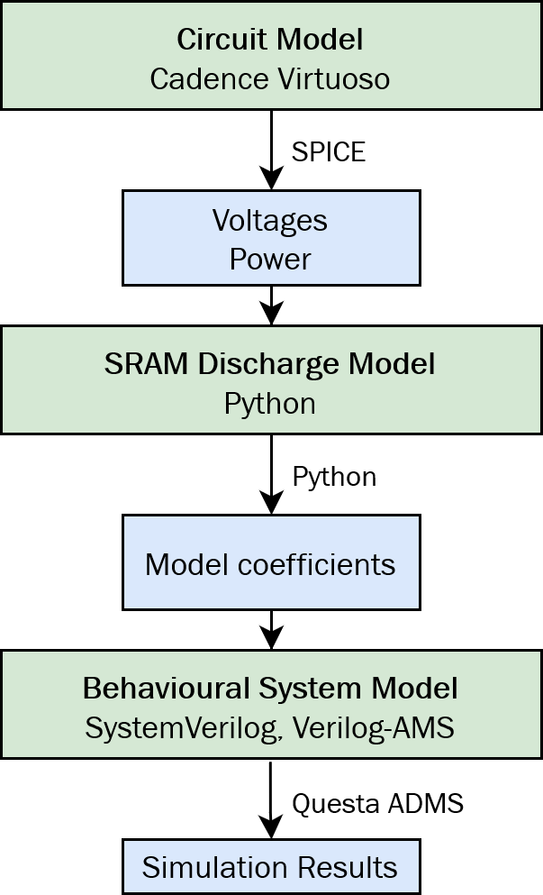

# OPTIMA - A Design-Space Exploration Methodology for Discharge-Based In-SRAM Computing

OPTIMA is a set of tools for fast design-space explorations for discharge-based in-SRAM computing circuits.
It was presented at the [2024 Design Automation Conference](https://www.dac.com/).

> TODO bibtex entry, link once proceedings are available
>
> [Saeed Seyedfaraji](mailto:saeed.seyedfaraji@tuwien.ac.at), [Severin Jäger](mailto:e1613004@student.tuwien.ac.at), Salar Shakibhamedan, Asad Aftab, Semeen Rehman
>
> OPTIMA: Design-Space Exploration of Discharge-Based In-SRAM Computing: Quantifying Energy-Accuracy Trade-offs

The code in this repository is split into two parts:

- `discharge-model`: A Python-based behavioural model for SRAM cell discharge
- `system-model`: A behavioural model for in-SRAM computing circuits implemented in SystemVerilog and Verilog-AMS

The modelling flow in OPTIMA is as follows:



> The OPTIMA flow is based on circuit simulation data. Examples are provided in `discharge-model/data`.

## SRAM Discharge Model

We tested the code with Python 3.9. Make sure to install all dependencies with

```
python -m pip install -r requirements.txt
```

To fit the model based on our demonstration data run

```
make fit
```

## Behavioural System Model

This model requires Questa ADMS to execute the `vasim` command.
We tested it with version 2020.4.

To run the top-level simulation testbench run

```
make sim
```

> The model parameters depend on the paramters fitted by the discharge model.
> A set of default paramters is provided in `system_model/include/sram_params.v`.
> This file is overwritten by `make fit`.

The demostration program can be modified in `system_model/tb/tb_top.sv` and the system model itself in `ms_top.vams`.
